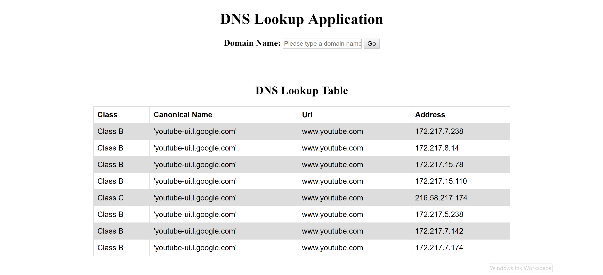

# Dns_lookup
The website that provide the nslookup to the typing domain name or hostname.The result is tell the user that this domain name have how many subdomain also know the classes of the ip

Web page: https://dnslookupweb.herokuapp.com

